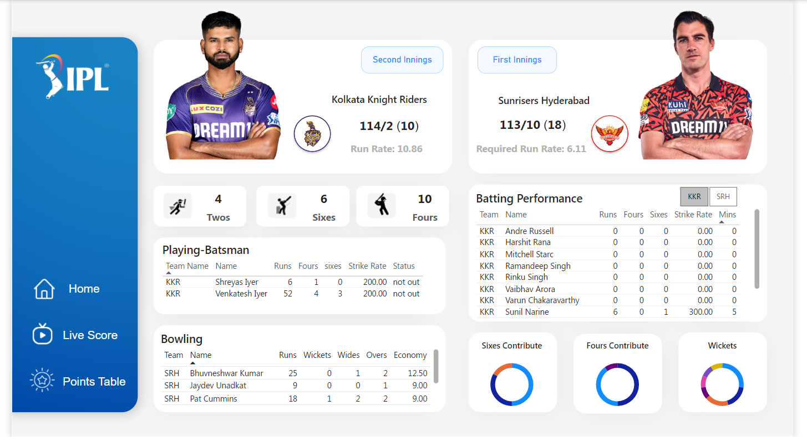
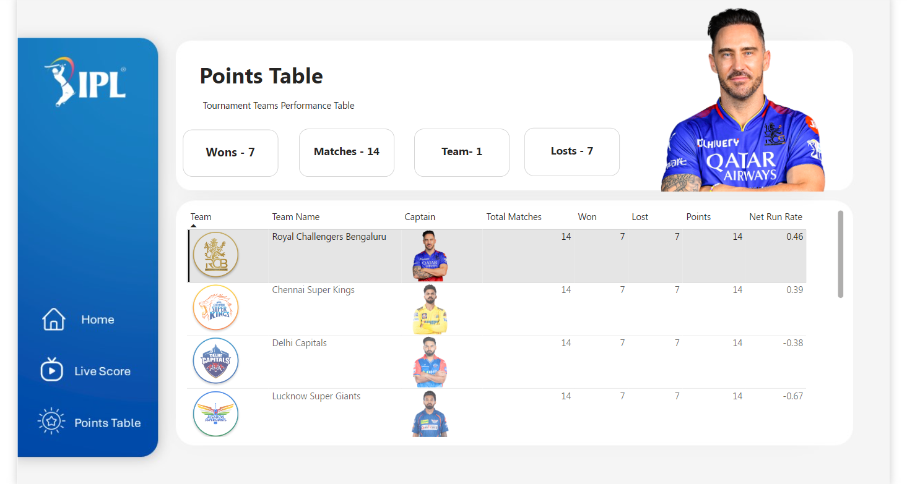

# IPL Dashboard 🏏  
An interactive **Indian Premier League (IPL) Dashboard** built with **PowerBI** to provide real-time updates on live matches, player statistics, and team standings.



## Overview 📊  
This IPL Dashboard is designed for cricket enthusiasts who want to track the progress of the IPL tournament in real-time. It fetches live data from the **Cricbuzz Cricket API**, offering comprehensive insights on ongoing matches, including batting and bowling performances, live scores, and team standings.

## Key Features ✨  
- **Live Match Scores:** Stay updated with real-time IPL match scores for all ongoing games.  
- **Batting & Bowling Stats:** Get in-depth statistics for both teams, covering key batting and bowling metrics.  
- **Points Table:** Track the current standings of all IPL teams as the tournament progresses.  

## Technologies Used ⚙  
- **PowerBI:** For creating the interactive and visually rich dashboard.  
- **Cricbuzz Cricket API:** To fetch live data such as scores, player stats, and team standings.  

## Screenshots 📸  
 


## How to Use 🚀  
To explore the dashboard:  
1. **Download PowerBI Desktop:** If you don’t have it installed, download it [here](https://powerbi.microsoft.com/desktop/).  
2. **Clone the Repository:**  
   ```bash
   git clone https://github.com/yourusername/IPL-Dashboard.git
   ```  
3. **Open the Dashboard:** Launch PowerBI Desktop, open the `.pbix` file, and connect to the Cricbuzz API to start getting live updates.

## Data Source  
The dashboard relies on the following data source:  
- **Cricbuzz Cricket API:** The data backbone of the project, providing up-to-date cricket scores and stats. 

## Feedback & Contribution 🤝  
We would love your feedback! If you have suggestions or find any issues, feel free to open an issue or submit a pull request. You can also reach out directly if you have any questions or need assistance.

## License  
This project is licensed under the [MIT License](LICENSE).  
